<div align="center">

# ⛏️ DeepMine AI
### Otonom Maden Analiz ve Ajan Tabanlı Planlama Sistemi

[](https://opensource.org/licenses/MIT)
[](https://www.python.org/downloads/)
[](https://docs.ros.org/en/humble/)
[](https://www.tensorflow.org/)
[](https://scikit-learn.org/)
[]()

<br />

**Milli Teknoloji Hamlesi İçin Yerli ve Otonom Çözümler**

[Proje Vizyonu](#-proje-vizyonu) •
[Özellikler](#-teknik-özellikler--modüller) •
[Derin Teknik Detaylar](#-derin-teknik-detaylar) •
[Kurulum](#-kurulum) •
[Geliştirici](#-geliştirici-hakkında)

</div>

---

## 🚀 Proje Vizyonu

**DeepMine AI**, madencilik sektöründe hammadde ihracatçısı kimliğinden **uç ürün teknolojisi üreten bir öncüye** dönüşme vizyonuyla geliştirilmiştir. 

> "Geleceğin madenciliği yerin altında değil, verinin derinliklerinde başlar."

Bu proje; **Multi-Agent Systems (MAS)**, **Bilgisayar Görüsü**, ve **Otonom Navigasyon** yöntemlerini birleştirerek maden sahalarındaki verimliliği maksimize etmeyi ve iş kazalarını dijital ikizler ve anlık takip sistemleri ile sıfıra indirmeyi hedefler.

---

## 🛠️ Teknik Özellikler & Modüller

### 1. � AI Agent Tabanlı Rezerv Planlama (Hybrid GPR-NN)
Sondaj ve jeofizik verilerini analiz ederek **3D cevher modellemesi** yapan karar destek sistemi.
*   **GPR (Gaussian Process Regression):** Yerel belirsizlikleri ve uzamsal korelasyonu (spatial correlation) minimize eder.
*   **Neural Networks (NN):** Geniş ölçekli jeolojik paternleri tanımlar.
*   **Sonuç:** Rezerv alanlarını yüksek doğrulukla tahmin ederek plansız duruşları engeller.

### 2. 🛸 Otonom Navigasyon (GPS-Free LiDAR SLAM)
GPS sinyalinin ulaşmadığı yer altı galerilerinde **LiDAR** ve **Sensör Füzyonu** ile tam otonom hareket.
*   **Algoritma:** RRT* tabanlı rota planlama ve Yapay Potansiyel Alanlar (Potential Fields) ile engel kaçınma.
*   **Teknoloji:** ROS 2 Humble katmanında C++ ile optimize edilmiş gerçek zamanlı navigasyon.

### 3. ⌚ Akıllı İSG ve Giyilebilir Takip (Smart OHS)
Personelin hayati verilerini ve ortamdaki gaz seviyelerini (Metan, CO2) anlık izleyen dağıtık IoT ağı.
*   **Dağıtık Mimari:** `isg_monitor_node` veriyi toplar, `alert_node` ise anomali tespiti yaparak acil durum protokollerini devreye sokar.

---

## 🏗️ Sistem Mimarisi

DeepMine AI, dağıtık bir **Multi-Agent System (MAS)** mimarisi üzerine kuruludur.

```mermaid
graph TD
    subgraph "Saha Veri Toplama (Edge Layer)"
        A[LiDAR & Kameralar] -->|Nokta Bulutu/Görüntü| B(ROS 2 Sensor Hub)
        C[IoT Sensör Ağı] -->|Gaz/Nabız/Konum| B
    end

    subgraph "Merkezi İşleme (Fog/Cloud Layer)"
        B -->|Ham Veri| D{Veri Ön İşleme & Füzyon}
        D --> E[Rezerv Tahmin AI Modeli]
        D --> F[SLAM & Haritalama]
        E -->|Rezerv Haritası| G[Karar Destek Sistemi]
        F -->|Konum Bilgisi| G
    end

    subgraph "Aksiyon & Arayüz (Application Layer)"
        G --> H[Otonom Navigasyon Rotası]
        G --> I[Dashboard & Uyarılar]
        H --> J((Otonom Maden Aracı))
        I --> K((Operatör))
    end
```



---

## 🔬 Derin Teknik Detaylar

### AI Modeli: Hibrit Tahminleme
Geleneksel madencilik modelleri statiktir. DeepMine AI, **Gaussian Process Regression (GPR)** kullanarak her bir sondaj noktası için bir güven aralığı (uncertainty) hesaplar.

$$ f(x) \sim \mathcal{GP}(m(x), k(x, x')) $$

Burada $k(x, x')$ çekirdek fonksiyonu (RBF-Kernel), cevherin yer altındaki sürekliliğini temsil eder.

### Navigasyon: Engel Kaçınma Mekanizması
Araç, LiDAR verilerini `/scan` topiğinden dinler. Engel tespiti anında potansiyel alanlar yöntemiyle itme vektörü oluşturulur:

$$ F_{total} = F_{attractive} + F_{repulsive} $$

Eğer bir engel 1 metre mesafeye girerse, araç otomatik olarak rotasını açılı bir manevra ile değiştirir.

---

## 💻 Kurulum ve Çalıştırma

### Gereksinimler
*   **OS:** Ubuntu 22.04 LTS (Humble)
*   **ROS 2 Packages:** `rclcpp`, `rclpy`, `sensor_msgs`, `nav_msgs`
*   **Python Libs:** `tensorflow`, `scikit-learn`, `numpy`

### Adımlar

1.  **Çalışma Alanını Derleyin:**
    ```bash
    colcon build --symlink-install
    source install/setup.bash
    ```

2.  **Tüm Sistemi Başlatın (Unified Launch):**
    ```bash
    ros2 launch teknofest_maden_teknolojileri deepmine_system_launch.py
    ```

3.  **AI Rezerv Tahmini Analizini Çalıştırın:**
    ```bash
    python3 src/ai_models/reserve_predictor.py
    ```

---

## 📂 Proje Yapısı

```bash
teknofest_maden_teknolojileri/
├── src/
│   ├── ai_models/          # 🧠 GPR-NN Hibrit Rezerv Modelleri
│   ├── autonomous_nav/     # 🛸 LiDAR tabanlı C++ Navigasyon Node'ları
│   └── sensor_hub/         # ⌚ IoT ve İSG Takip Protokolleri
├── launch/                 # � ROS 2 Launch Dosyaları
├── docs/                   # � Teknik Raporlar ve Metodoloji
└── simulation/             # 🎮 Gazebo Simülasyon Konfigürasyonu
```

---

## 📈 Yarışma Yol Haritası (TEKNOFEST 2026)

- [x] **Başvuru:** 20.02.2026 ✅
- [x] **Temel Modül Geliştirme:** (AI, Nav, İSG) ✅
- [ ] **Ön Değerlendirme Raporu:** 01.04.2026 📝
- [ ] **Yarı Final Sunumu:** Temmuz 2026 🎤
- [ ] **Final / Şanlıurfa:** Eylül 2026 🏆

---

## 👤 Geliştirici Hakkında

<div align="center">

**Bahattin Yunus**
*Yazılım, Mekatronik ve Veri Bilimi Tutkunu*

[GitHub](https://github.com/bahattinyunus) • [LinkedIn](#) • [Email](#)

</div>

---

### ⚖️ Sorumluluk Beyanı
Bu proje **T3 Vakfı** ve **TEKNOFEST Maden Teknolojileri Yarışması** şartnamesine uygun olarak geliştirilmiştir.

<div align="center">
<sub>Made with ❤️ by Bahattin Yunus</sub>
</div>
